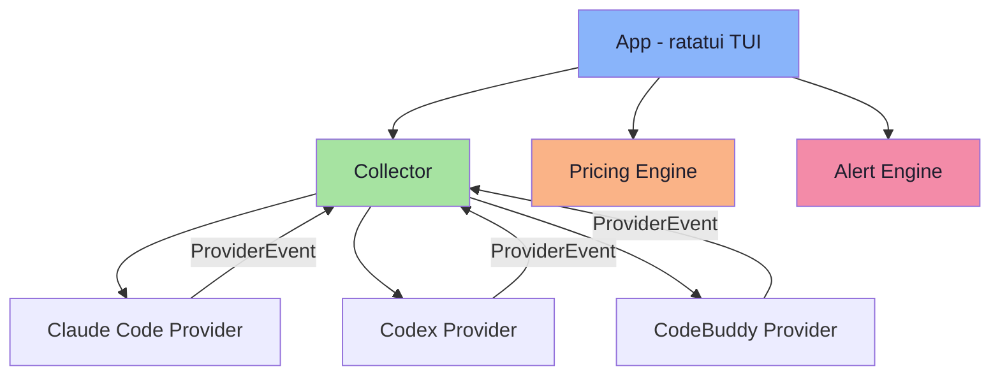

<div align="center">

<br>

```
████████╗ ██████╗ ██╗  ██╗███████╗███╗   ███╗ ██████╗ ███╗   ██╗
╚══██╔══╝██╔═══██╗██║ ██╔╝██╔════╝████╗ ████║██╔═══██╗████╗  ██║
   ██║   ██║   ██║█████╔╝ █████╗  ██╔████╔██║██║   ██║██╔██╗ ██║
   ██║   ██║   ██║██╔═██╗ ██╔══╝  ██║╚██╔╝██║██║   ██║██║╚██╗██║
   ██║   ╚██████╔╝██║  ██╗███████╗██║ ╚═╝ ██║╚██████╔╝██║ ╚████║
   ╚═╝    ╚═════╝ ╚═╝  ╚═╝╚══════╝╚═╝     ╚═╝ ╚═════╝ ╚═╝  ╚═══╝
```

### 🖥️ Token Monitor — Terminal dashboard for AI coding tools

<br>

[](LICENSE)
[](https://www.rust-lang.org)
[](http://makeapullrequest.com)

<br>

[English](README.md) · [中文](README_CN.md) · [Quick Start](#-quick-start) · [Features](#-features) · [Configuration](#%EF%B8%8F-configuration)

</div>

<br>

## 🚀 Quick Start

```bash
# Install
cargo install --path .

# Set up Claude Code integration (one-time)
tokemon setup claude-code

# Restart Claude Code, then start monitoring
tokemon
```

> [!TIP]
> Run `tokemon --demo` first to explore the UI without any provider setup.

<br>

## ✨ Features

<table>
<tr>
<td width="50%">

### 📊 Real-time Monitoring
- Token usage — input / output / cached
- Context window % with color-coded gauge
- Input/output throughput (tokens/sec)
- Session status with pill badge

</td>
<td width="50%">

### 💰 Cost Estimation
- Built-in pricing for Claude, GPT, O3
- Cache token pricing (write / read)
- User-configurable model overrides
- Render-time estimation — change price, instant update

</td>
</tr>
<tr>
<td>

### 🗂️ Overview Dashboard
- Card grid layout (auto 1/2 columns)
- Per-session mini trend charts
- Vim-style navigation (`h/j/k/l`)
- Scroll hints with page indicator

</td>
<td>

### 🔍 Session Detail Tabs
- Full detail panel, table-aligned fields
- Token rate + cost trend charts
- Git branch + working directory
- ANSI Shadow ASCII art header

</td>
</tr>
</table>

<br>

## 🎯 Why tokemon?

> **One dashboard to rule them all.** Stop alt-tabbing between terminals. Stop checking billing portals after the fact.

| | Without tokemon | With tokemon |
|:--|:--|:--|
| 👀 **Visibility** | Scattered logs per tool | Unified dashboard, all sessions at a glance |
| 💵 **Cost** | Check billing portal later | Real-time estimation with per-model pricing |
| 📐 **Context** | No idea how full the window is | Live gauge with 80% / 95% alerts |
| 🪟 **Multi-session** | Alt-tab between terminals | Card grid + per-session tabs |
| ⚡ **Speed** | No way to measure throughput | Input/output tokens per second |

<br>

## ⌨️ Keybindings

```
  1-9 .............. Jump to tab (1=Overview, 2+=sessions)
  Tab / S-Tab ...... Next / previous tab
  j/k ↑/↓ ......... Navigate cards up/down
  h/l ←/→ ......... Navigate cards left/right
  Enter ............ Open session detail tab
  Esc .............. Back to Overview / Quit
  ? ................ Help overlay
  q / Ctrl+C ....... Quit
```

<br>

## 🔌 Supported Providers

| Provider | Data Source | Setup | Status |
|:--|:--|:--|:--|
| **Claude Code** | Statusline socket + JSONL logs | `tokemon setup claude-code` | ✅ Ready |
| **Codex** (OpenAI) | Log file watching | — | 🔜 Phase 2 |
| **CodeBuddy** | Log file watching | — | 🔜 Phase 2 |
| **Custom** | User-defined socket / file | — | 🧩 Extensible |

> [!NOTE]
> `tokemon setup claude-code` automatically installs `~/.claude/statusline.sh` and updates `~/.claude/settings.json`. Restart Claude Code after setup.
>
> Adding a new provider: implement the `Provider` trait (~5 methods), register in `Collector`, done.

<br>

## ⚙️ Configuration

Default path: `~/.config/tokemon/config.toml`

<details>
<summary><b>📄 Full config example</b></summary>

<br>

```toml
[general]
tick_rate_ms = 250
theme = "dark"

[providers.claude_code]
enabled = true
socket_path = "$TMPDIR/tokemon-claude.sock"
log_dirs = ["~/.claude/projects/"]

[providers.codex]
enabled = false
log_dirs = ["~/.codex/"]

[pricing]
default_input = 3.0    # $/1M tokens fallback
default_output = 15.0

[pricing.models]
"claude-sonnet-4-20250514" = { input = 3.0, output = 15.0, cache_write = 3.75, cache_read = 0.30 }
"claude-opus-4-20250514"   = { input = 15.0, output = 75.0, cache_write = 18.75, cache_read = 1.50 }
"o3"                       = { input = 10.0, output = 40.0 }
"gpt-4.1"                  = { input = 2.0, output = 8.0 }

[alerts]
context_warn_pct = 80.0
context_crit_pct = 95.0
cost_threshold_usd = 5.0
```

</details>

<br>

## 🏗️ Architecture



<br>

## 🧱 Tech Stack

| | Component | Why |
|:--|:--|:--|
| 🖼️ | [ratatui](https://github.com/ratatui/ratatui) 0.29 | TUI framework with Chart, Gauge, built-in widgets |
| 💻 | [crossterm](https://github.com/crossterm-rs/crossterm) 0.28 | Cross-platform terminal backend |
| ⚡ | [tokio](https://tokio.rs/) | Async runtime for concurrent provider collection |
| 👁️ | [notify](https://github.com/notify-rs/notify) 7 | File system watching for log tailing + config reload |
| 📋 | [clap](https://github.com/clap-rs/clap) 4 | CLI argument parsing |
| 📐 | [toml](https://github.com/toml-rs/toml) | Config file parsing |

<br>

## 📝 License

[MIT](LICENSE) — do whatever you want.

---

<div align="center">
<sub>Built with 🦀 Rust + ratatui · Catppuccin Mocha theme · Made for AI-assisted developers</sub>
</div>
