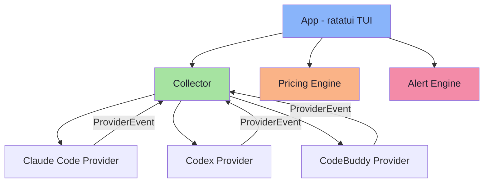

<div align="center">

<br>

```
████████╗ ██████╗ ██╗  ██╗███████╗███╗   ███╗ ██████╗ ███╗   ██╗
╚══██╔══╝██╔═══██╗██║ ██╔╝██╔════╝████╗ ████║██╔═══██╗████╗  ██║
   ██║   ██║   ██║█████╔╝ █████╗  ██╔████╔██║██║   ██║██╔██╗ ██║
   ██║   ██║   ██║██╔═██╗ ██╔══╝  ██║╚██╔╝██║██║   ██║██║╚██╗██║
   ██║   ╚██████╔╝██║  ██╗███████╗██║ ╚═╝ ██║╚██████╔╝██║ ╚████║
   ╚═╝    ╚═════╝ ╚═╝  ╚═╝╚══════╝╚═╝     ╚═╝ ╚═════╝ ╚═╝  ╚═══╝
```

### 🖥️ Token Monitor — AI 编码工具终端监控面板

<br>

[](LICENSE)
[](https://www.rust-lang.org)
[](http://makeapullrequest.com)

<br>

[English](README.md) · [中文](README_CN.md) · [快速开始](#-快速开始) · [功能](#-功能) · [配置](#%EF%B8%8F-配置)

</div>

<br>

## 🚀 快速开始

```bash
# 安装
cargo install --path .

# 设置 Claude Code 集成（一次性）
tokemon setup claude-code

# 重启 Claude Code，然后开始监控
tokemon
```

> [!TIP]
> 先跑 `tokemon --demo` 体验 UI，无需配置任何 Provider。

<br>

## ✨ 功能

<table>
<tr>
<td width="50%">

### 📊 实时监控
- Token 用量 — 输入 / 输出 / 缓存
- 上下文窗口 % 带色彩进度条
- 输入/输出吞吐速率 (tokens/sec)
- Pill 风格状态徽章

</td>
<td width="50%">

### 💰 费用估算
- 内置 Claude、GPT、O3 定价
- 缓存 token 定价（写入/读取）
- 用户自定义模型价格覆盖
- 渲染时估算 — 改价即刻生效

</td>
</tr>
<tr>
<td>

### 🗂️ Overview 仪表盘
- 卡片网格布局（自动 1/2 列）
- 每个 session 带迷你趋势图
- Vim 风格导航（`h/j/k/l`）
- 滚动提示 + 页码指示

</td>
<td>

### 🔍 Session 详情页
- 完整详情面板，表格对齐
- Token 速率 + 费用趋势图
- Git 分支 + 工作目录
- ANSI Shadow ASCII 艺术字头部

</td>
</tr>
</table>

<br>

## 🎯 为什么需要 tokemon？

> **一个面板统御所有工具。** 不用再在终端之间切来切去，不用事后查账单。

| | 没有 tokemon | 有 tokemon |
|:--|:--|:--|
| 👀 **可见性** | 每个工具各自日志，分散各处 | 统一面板，所有 session 一目了然 |
| 💵 **费用** | 事后去账单页面查 | 实时估算，逐模型定价 |
| 📐 **上下文** | 不知道窗口还剩多少 | 实时进度条 + 80% / 95% 告警 |
| 🪟 **多会话** | 在终端之间 Alt-tab | 卡片网格 + 独立 tab |
| ⚡ **吞吐量** | 无法度量 | 输入/输出 tokens/秒 |

<br>

## ⌨️ 快捷键

```
  1-9 .............. 跳转 tab（1=Overview，2+=各 session）
  Tab / S-Tab ...... 下一个 / 上一个 tab
  j/k ↑/↓ ......... 上下导航卡片
  h/l ←/→ ......... 左右导航卡片
  Enter ............ 打开 session 详情 tab
  Esc .............. 返回 Overview / 退出
  ? ................ 帮助弹窗
  q / Ctrl+C ....... 退出
```

<br>

## 🔌 已支持的工具

| Provider | 数据来源 | 安装 | 状态 |
|:--|:--|:--|:--|
| **Claude Code** | Statusline socket + JSONL 日志 | `tokemon setup claude-code` | ✅ 就绪 |
| **Codex** (OpenAI) | 日志文件监听 | — | 🔜 Phase 2 |
| **CodeBuddy** | 日志文件监听 | — | 🔜 Phase 2 |
| **Custom** | 用户自定义 socket / 文件 | — | 🧩 可扩展 |

> [!NOTE]
> `tokemon setup claude-code` 会自动安装 `~/.claude/statusline.sh` 并更新 `~/.claude/settings.json`。安装后重启 Claude Code 即可。
>
> 新增 Provider：实现 `Provider` trait（约 5 个方法），注册到 `Collector`，完事。

<br>

## ⚙️ 配置

默认路径：`~/.config/tokemon/config.toml`

<details>
<summary><b>📄 完整配置示例</b></summary>

<br>

```toml
[general]
tick_rate_ms = 250
theme = "dark"

[providers.claude_code]
enabled = true
socket_path = "$TMPDIR/tokemon-claude.sock"
log_dirs = ["~/.claude/projects/"]

[providers.codex]
enabled = false
log_dirs = ["~/.codex/"]

[pricing]
default_input = 3.0    # 未知模型兜底价 ($/1M tokens)
default_output = 15.0

[pricing.models]
"claude-sonnet-4-20250514" = { input = 3.0, output = 15.0, cache_write = 3.75, cache_read = 0.30 }
"claude-opus-4-20250514"   = { input = 15.0, output = 75.0, cache_write = 18.75, cache_read = 1.50 }
"o3"                       = { input = 10.0, output = 40.0 }
"gpt-4.1"                  = { input = 2.0, output = 8.0 }

[alerts]
context_warn_pct = 80.0      # 上下文黄色警告阈值
context_crit_pct = 95.0      # 上下文红色警告阈值
cost_threshold_usd = 5.0     # 费用告警阈值
```

</details>

<br>

## 🏗️ 架构



<br>

## 🧱 技术栈

| | 组件 | 用途 |
|:--|:--|:--|
| 🖼️ | [ratatui](https://github.com/ratatui/ratatui) 0.29 | TUI 框架，内置 Chart/Gauge 等组件 |
| 💻 | [crossterm](https://github.com/crossterm-rs/crossterm) 0.28 | 跨平台终端后端 |
| ⚡ | [tokio](https://tokio.rs/) | 异步运行时，并发采集 Provider 数据 |
| 👁️ | [notify](https://github.com/notify-rs/notify) 7 | 文件系统监听，日志尾随 + 配置热重载 |
| 📋 | [clap](https://github.com/clap-rs/clap) 4 | CLI 参数解析 |
| 📐 | [toml](https://github.com/toml-rs/toml) | 配置文件解析 |

<br>

## 📝 许可

[MIT](LICENSE) — 随便用。

---

<div align="center">
<sub>基于 🦀 Rust + ratatui 构建 · Catppuccin Mocha 主题 · 为 AI 辅助开发者打造</sub>
</div>
